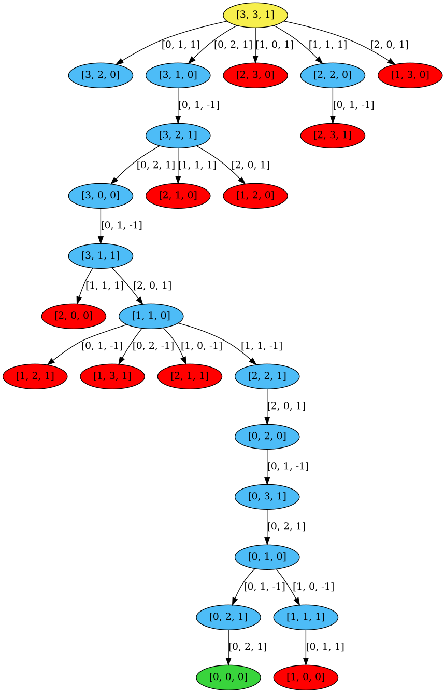

# Missionaries-and-Cannibals
Generating State Space tree for Missionaries and Cannibals problem.

## Installation
- Install [graphviz](https://graphviz.org/download/) in your system
```
pip install -r requirements.txt
```

## Generating Tree
```
python main.py
```
**Note:**
- Yellow color : *Initial state node* 
- Blue color : *Valid state node*
- Red color : *Killed node*
- Green color : *Goal state node*


